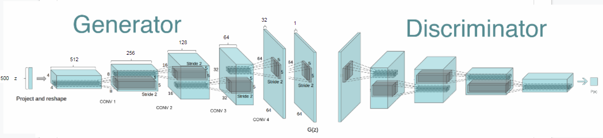
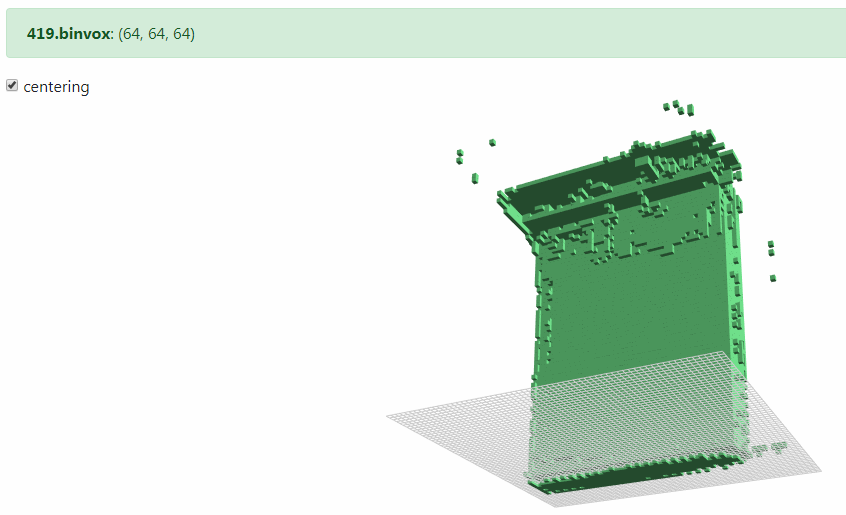

# Modelnet-DCGAN-tensorflow
Shape generating DCGAN using tensorflow

## Dataset: ModelNet10 
http://modelnet.cs.princeton.edu/# \
I only used objects from bed class to test my model.

## Data preparation 
Reference: https://github.com/guoguo12/modelnet-cnn3d_bn

**.off -(1.voxelize)-> .binvox -(2.read)-> [npz file](modelnet10_bed.npz)**

1. Voxelize \
Read in [.off] file and change it into [.binvox] file of binary voxel data , using [binvox](http://www.patrickmin.com/binvox/) program. \
I implemented a process call to the binvox program from python in [off2binvox.py](off2binvox.py). \ 
You can also adjust the voxel size here. I made it with size (64, 64, 64).

2. Read \
Read [.binvox] file and create an npz file with (64,64,64) shaped(your specified voxel size) elements, using [binvox2npz.py](binvox2npz.py). The imported [binvox.py](binvox.py) is for python3.

## Network architecture
Reference: https://github.com/maxorange/voxel-dcgan and https://github.com/meetshah1995/tf-3dgan/blob/master/src/3dgan_test.py

A rough architecture of the network is shown below. (I just changed numbers from an image for 2d-DCGAN architecture, which I got from [google](https://www.google.com/search?q=dcgan+architecture&newwindow=1&safe=strict&rlz=1C1NHXL_koKR759KR759&source=lnms&tbm=isch&sa=X&ved=0ahUKEwitrp2cv67iAhVKG6YKHTYtCMsQ_AUIDigB&biw=1555&bih=864#imgrc=UFVwctxHReG4gM:).)

## Visualization
[.binvox] file can be viewed [here](https://github.com/raahii/simple_voxel_viewer). \
I also implemented a process call to [the viewvox program](http://www.patrickmin.com/viewvox/) in [view.py](view.py). Download the program and give arguments with files you want.

## Results
The generated objects were not good enough. Need to figure out what went wrong.\

## Study(paper review)
https://docs.google.com/presentation/d/1U2lyelslkJVvcj1OfciDYfWCSXjAoOtyMsMDr3b8FAg/edit?usp=sharing
